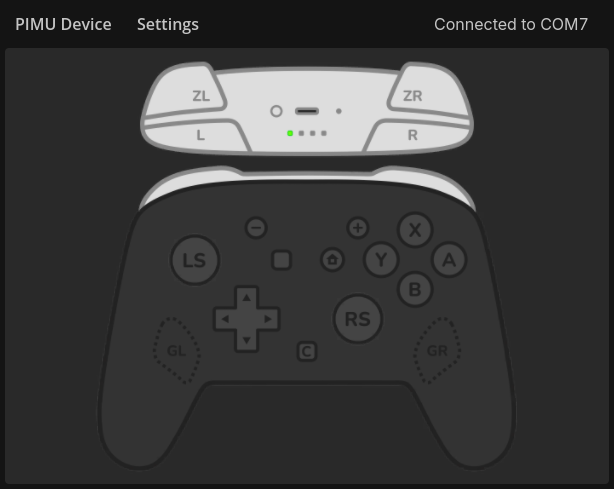
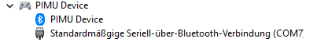

# PIMU - A Switch 2 Pro controller simulator
PIMU is a combination of desktop app and Raspberry pico firmware to play Switch 2 games with keyboard and mouse!

The goal of this tool is to convert mouse (Pointer) signals to gyro (IMU) controls. This is achieved by having a Pico be plugged into the switch 2 via USB and simulating pro controller 2 behavior, which receives its inputs from a desktop running the PIMU desktop app (connected via bluetooth or a USB-TTL interface).

> [!NOTE]  
> This does not require your console to be modified in any way! You can use this on any the Switch 2 as is

# Supported games
This software has primarily been designed to be used and been tested with Splatoon 3 and Splatoon Raiders. While other games can be played with it too, there is no guarantee that the gyro inputs will work for every other game as well.

# Setup
1. Download the firmware (.uf2) for your pico model from the [releases page](https://github.com/Justin113D/PIMU/releases)
2. Press the BOOTSEL button on your pico while plugging it into your PC
3. Copy the .uf2 file into the pico folder that has been opened to install the firmware
4. Unplug the pico from your pc and plug it into your Switch 2 dock
5. Download the desktop app from the [releases page](https://github.com/Justin113D/PIMU/releases) and start it

> [!NOTE]  
> Connect only after the switch has already been turned on. If the switch enters standby or turns on, then it will restart your pico, which severs the connection with the desktop app

## Connect via USB-TTL
1. Connect your USB-TTL interface to the GPIO0 (UART0 TX) and GPIO1 (UART0 RX) pins
2. In the desktop app, connect to the COM endpoint of your interface

## Connect via bluetooth
If you have a pico with wireless capabilities, then you can connect to it via bluetooth.

> [!WARNING]  
> If you want to make use of gyro, then this option is not recommended, as package loss and insufficient data throughput cause stuttering!

1. Connect to the pico via your OS' bluetooth settings. The pico should appear under the name "PIMU Device"
2. Find out which serial channel the device has been registered under
    1. On windows, you can do this via the device manager
    2. On the device manager, change the view mode to "Devices by container"
    3. Find "PIMU Device"
    4. Check the "COM" number   
3. In the desktop app, connect to the COM endpoint (may take 2 or 3 attempts)

# Usage
Click the controller graphic to enter the "capture input" mode. You can exit this mode by pressing "escpae".

While in this mode, the app checks your keyboard and mouse inputs against your input mapping (configurable via the settings menu), translates it to controller inputs and sends it to the Pico connected to your switch.

# Debugging
If enabled in the firmware settings, the pico will send debug information over the second UART channel exposed via pins GPIO8 (UART1 TX) and GPIO9 (UART1 RX).

You can also enable receiving debug information via your primary connection, although this will not send all debug info to prevent recursive debug information. The output can be viewed by enabling the debug output in the app settings.
